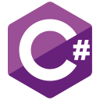
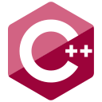

# Hi, I'm Min-Kyu 👋

## A bit about me

### I am

- 💻 a developer
- 🎓 Computer Science and Business Administration student studying at the University of Waterloo and Wilfird Laurier University

### I've worked as a(n)

- 🍎 iOS Developer
- 🤖 Android Developer
- 🌐 Full-Stack Engineer
- 🏗️ DevOps Engineer

## Some languages and tools I've used in the past

### Languages

<table>
<tbody>
    <tr align="center" valign="center">
        <td width="10%" align="center">
			
        </td>
        <td width="10%" align="center">
			
        </td>
        <td width="10%" align="center">
			
        </td>
        <td width="10%" align="center">
			
        </td>
        <td width="10%" align="center">
			
        </td>
        <td width="10%" align="center">
			
        </td>
        <td width="10%" align="center">
			
        </td>
        <td width="10%" align="center">
			
        </td>
        <td width="10%" align="center">
			
        </td>
        <td width="10%" align="center">
			
        </td>
    </tr>
    <tr align="center" valign="center">
 		<td width="10%" align="center">
			<a href="https://kotlinlang.org/">
				<b>
					Kotlin
				</b>
			</a>
		</td>
 		<td width="10%" align="center">
			<a href="https://www.swift.org/">
				<b>
					Swift
				</b>
			</a>
		</td>
 		<td width="10%" align="center">
			<a href="https://www.typescriptlang.org/">
				<b>
					Typescript
				</b>
			</a>
		</td>
 		<td width="10%" align="center">
			<a href="https://ecma-international.org/">
				<b>
					Javascript
				</b>
			</a>
		</td>
 		<td width="10%" align="center">
			<a href="https://www.java.com/en/">
				<b>
					Java
				</b>
			</a>
		</td>
 		<td width="10%" align="center">
			<a href="https://html.spec.whatwg.org/multipage/">
				<b>
					HTML
				</b>
			</a>
		</td>
 		<td width="10%" align="center">
			<a href="https://www.w3.org/Style/CSS/Overview.en.html">
				<b>
					CSS
				</b>
			</a>
		</td>
 		<td width="10%" align="center">
			<a href="https://www.python.org/">
				<b>
					Python
				</b>
			</a>
		</td>
 		<td width="10%" align="center">
			<a href="https://learn.microsoft.com/en-us/dotnet/csharp/">
				<b>
					C#
				</b>
			</a>
		</td>
        <td width="10%" align="center">
			<a href="https://cplusplus.com/">
				<b>
					C++
				</b>
			</a>
		</td>
    </tr>
</tbody>
</table>

### Javascript Libraries

<table>
<tbody>
	<tr align="center" valign="center">
		<td width="14.28571%" align="center">
			
		</td>
		<td width="14.28571%" align="center">
			
		</td>
		<td width="14.28571%" align="center">
			
		</td>
		<td width="14.28571%" align="center">
			
		</td>
		<td width="14.28571%" align="center">
			
		</td>
		<td width="14.28571%" align="center">
			
		</td>
		<td width="14.28571%" align="center">
			
		</td>
	</tr>
	<tr align="center" valign="center">
 		<td width="14.28571%" align="center">
			<a href="https://react.dev/">
				<b>
					React
				</b>
			</a>
		</td>
 		<td width="14.28571%" align="center">
			<a href="https://angular.io/">
				<b>
					Angular
				</b>
			</a>
		</td>
 		<td width="14.28571%" align="center">
			<a href="https://vuejs.org/">
				<b>
					Vue.js
				</b>
			</a>
		</td>
 		<td width="14.28571%" align="center">
			<a href="https://www.gatsbyjs.com/">
				<b>
					Gatsby
				</b>
			</a>
		</td>
 		<td width="14.28571%" align="center">
			<a href="https://webpack.js.org/">
				<b>
					Webpack
				</b>
			</a>
		</td>
 		<td width="14.28571%" align="center">
			<a href="https://redux.js.org/">
				<b>
					Redux
				</b>
			</a>
		</td>
 		<td width="14.28571%" align="center">
			<a href="https://babeljs.io/">
				<b>
					Babel
				</b>
			</a>
		</td>
	</tr>
</tbody>
</table>
